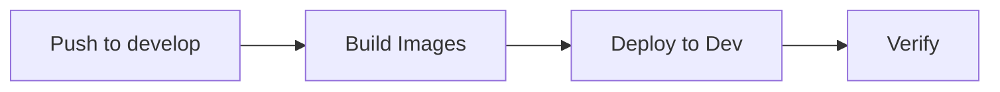
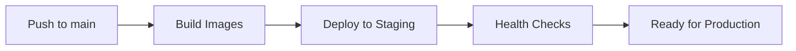
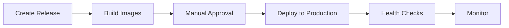

# CI/CD Deployment Guide

## Overview

Aura uses GitHub Actions for automated Docker image building and Kubernetes deployments.

## Workflows

### 1. Docker Image Building (`docker-build.yml`)

**Triggers:**

- Push to `main` or `develop` branches
- Release creation
- Manual workflow dispatch

**What it does:**

- Builds backend Docker image (production target)
- Builds web dashboard Docker image
- Pushes images to GitHub Container Registry (GHCR)
- Tags images with git SHA or release tag

**Image Tags:**

- `latest` - Always points to latest build
- `{git-sha}` - Specific commit SHA
- `{release-tag}` - Release version (e.g., `v1.0.0`)

### 2. Development Deployment (`k8s-deploy-dev.yml`)

**Triggers:**

- Push to `develop` or `feature/**` branches
- Manual workflow dispatch

**What it does:**

- Deploys to `aura-dev` namespace
- Uses kustomize to apply dev overlay
- Waits for rollout to complete

**Prerequisites:**

- `KUBECONFIG_DEV` secret in GitHub repository

### 3. Staging Deployment (`k8s-deploy-staging.yml`)

**Triggers:**

- Push to `main` branch
- Manual workflow dispatch

**What it does:**

- Deploys to `aura-staging` namespace
- Updates image tags in kustomization
- Waits for rollout to complete
- Runs health checks

**Prerequisites:**

- `KUBECONFIG_STAGING` secret in GitHub repository
- Staging environment configured in GitHub

### 4. Production Deployment (`k8s-deploy-prod.yml`)

**Triggers:**

- Release publication
- Manual workflow dispatch (requires confirmation)

**What it does:**

- Deploys to `aura-production` namespace
- Updates image tags to release version
- Requires manual confirmation (type "deploy")
- Waits for rollout to complete
- Runs production health checks

**Prerequisites:**

- `KUBECONFIG_PRODUCTION` secret in GitHub repository
- Production environment configured in GitHub
- Manual approval required

## Setup

### 1. Configure GitHub Secrets

Add the following secrets to your GitHub repository:

**For Development:**

```
KUBECONFIG_DEV=<base64-encoded-kubeconfig>
```

**For Staging:**

```
KUBECONFIG_STAGING=<base64-encoded-kubeconfig>
```

**For Production:**

```
KUBECONFIG_PRODUCTION=<base64-encoded-kubeconfig>
```

**To get kubeconfig:**

```bash
# Get kubeconfig and encode it
cat ~/.kube/config | base64
```

### 2. Configure GitHub Environments

1. Go to repository Settings → Environments
2. Create environments: `staging`, `production`
3. Configure protection rules:
   - **Staging**: Optional reviewers
   - **Production**: Required reviewers, deployment branches (main only)

### 3. Configure Image Registry

Images are pushed to GitHub Container Registry (GHCR):

- Registry: `ghcr.io`
- Format: `ghcr.io/{owner}/aura-backend:{tag}`
- Format: `ghcr.io/{owner}/aura-web-dashboard:{tag}`

**Permissions:**

- Workflows automatically have `GITHUB_TOKEN` with package write permissions
- No additional setup needed for public repositories

## Deployment Flow

### Development



1. Push code to `develop` branch
2. Images are built and pushed to GHCR
3. Deployment workflow triggers
4. Services deployed to `aura-dev` namespace

### Staging



1. Merge to `main` branch
2. Images are built with `staging` tag
3. Deployment workflow triggers
4. Services deployed to `aura-staging` namespace
5. Health checks run

### Production



1. Create GitHub release
2. Images are built with release tag
3. Manual approval required
4. Services deployed to `aura-production` namespace
5. Health checks run
6. Monitor deployment

## Manual Deployment

### Using Workflows

1. Go to Actions tab in GitHub
2. Select workflow (e.g., "Deploy to Production")
3. Click "Run workflow"
4. Enter parameters:
   - Image tag (e.g., `v1.0.0`)
   - Confirmation (for production: type "deploy")
5. Click "Run workflow"

### Using kubectl

```bash
# Update image tags
cd k8s/overlays/production
kustomize edit set image \
  aura-backend=ghcr.io/ofircohen205/aura-backend:v1.0.0 \
  aura-web-dashboard=ghcr.io/ofircohen205/aura-web-dashboard:v1.0.0

# Deploy
kubectl apply -k k8s/overlays/production

# Verify
kubectl rollout status deployment/backend -n aura-production
```

## Rollback

### Using Script

```bash
./k8s/scripts/rollback.sh production backend
```

### Using kubectl

```bash
# View rollout history
kubectl rollout history deployment/backend -n aura-production

# Rollback to previous revision
kubectl rollout undo deployment/backend -n aura-production

# Rollback to specific revision
kubectl rollout undo deployment/backend -n aura-production --to-revision=2
```

## Image Tagging Strategy

### Development

- Tag: `dev` or git SHA
- Updated: On every push to develop

### Staging

- Tag: `staging` or git SHA
- Updated: On merge to main

### Production

- Tag: Release version (e.g., `v1.0.0`)
- Updated: On release creation
- Also tagged: `latest`

## Best Practices

1. **Always test in staging before production**
2. **Use semantic versioning for releases**
3. **Monitor deployments in GitHub Actions**
4. **Set up notifications for deployment failures**
5. **Keep deployment history for rollback**
6. **Use feature flags for gradual rollouts**
7. **Run health checks after deployment**
8. **Monitor metrics and logs post-deployment**

## Troubleshooting

### Deployment Fails

```bash
# Check workflow logs in GitHub Actions
# Check pod status
kubectl get pods -n aura-production

# Check deployment events
kubectl describe deployment backend -n aura-production

# Check pod logs
kubectl logs -n aura-production deployment/backend
```

### Images Not Found

```bash
# Verify images exist in GHCR
# Check image pull secrets
kubectl get secrets -n aura-production

# Check image pull policy
kubectl get deployment backend -n aura-production -o yaml | grep imagePullPolicy
```

### Rollout Stuck

```bash
# Check rollout status
kubectl rollout status deployment/backend -n aura-production

# Check replica sets
kubectl get rs -n aura-production

# Check pod events
kubectl describe pod <pod-name> -n aura-production
```

## Security Considerations

1. **Secrets**: Never commit kubeconfig files
2. **Permissions**: Use least privilege for service accounts
3. **Image Scanning**: Scan images for vulnerabilities
4. **Approvals**: Require manual approval for production
5. **Audit**: Review deployment logs regularly

## Next Steps

- Set up deployment notifications (Slack, email)
- Configure automated rollback on health check failures
- Add deployment metrics and dashboards
- Set up canary deployments (future)
- Integrate with GitOps (Argo CD/Flux) - optional
