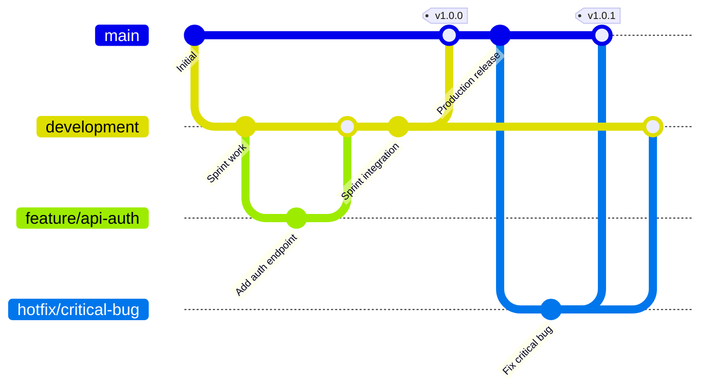

# Development Workflow

## Git Workflow

### Branch Naming Convention

**Format**: `<type>/<scope>-<short-description>`

**Types**:
- `feature/` - New features
- `fix/` - Bug fixes
- `hotfix/` - Critical production fixes
- `refactor/` - Code improvements/restructuring
- `chore/` - Maintenance tasks (dependencies, config)
- `test/` - Test additions
- `experiment/` - POCs and experiments

**Examples**:

```bash
feature/api-user-authentication
feature/ui-dashboard-layout
fix/login-bug
hotfix/memory-leak-rag
refactor/component-search-bar
chore/update-dependencies
```

### Branch Structure

The repository uses a three-branch structure:

- **`feature` branches**: Single task branches (feature/, fix/, refactor/, etc.) for individual work items
- **`development` branch**: Integration branch for sprint work, contains sets of tasks being developed
- **`main` branch**: Production-ready code, receives merges from `development` with automatic tags

### Branch Workflow



#### Standard Feature Workflow

```bash
# 1. Start from development branch
git checkout development
git pull origin development

# 2. Create a new feature branch
git checkout -b feature/your-feature-name

# 3. Make your changes and commit
git add .
git commit -m "feat: add user authentication endpoint [JIRA-123]"

# 4. Push to remote
git push origin feature/your-feature-name

# 5. Create Pull Request targeting development branch
# 6. After review and approval, merge into development
```

#### Development to Main Workflow

When sprint work is complete and ready for production:

```bash
# 1. Ensure development branch is up to date
git checkout development
git pull origin development

# 2. Create Pull Request from development to main
# 3. After approval, merge into main
# 4. CI/CD automatically creates a tag (e.g., v1.0.0) when merge completes
```

**Note**: Tags are automatically created by CI/CD when merging from `development` to `main`. Tag format follows semantic versioning (e.g., `v1.0.0`, `v1.1.0`).

#### Creating Tags and Releases Manually

If you need to create a tag or release manually (e.g., if CI/CD didn't create one, or for hotfixes):

**1. Create and Push a Tag**:

```bash
# Ensure you're on the main branch and it's up to date
git checkout main
git pull origin main

# Create an annotated tag (recommended for releases)
git tag -a v1.2.0 -m "Release v1.2.0"

# Or create a lightweight tag
git tag v1.2.0

# Push the tag to GitHub
git push origin v1.2.0

# Or push all tags at once
git push origin --tags
```

**2. Create a GitHub Release**:

**Via GitHub Web Interface**:
1. Navigate to your repository on GitHub
2. Click on "Releases" in the right sidebar (or go to `https://github.com/[OWNER]/[REPO]/releases`)
3. Click "Draft a new release"
4. Select the tag you just created (or create a new tag from the dropdown)
5. Fill in:
   - **Release title**: "Release v1.2.0" (or match your tag name)
   - **Description**: Summary of changes, features, bug fixes included in this release
   - **Attach binaries**: If you have build artifacts to include
6. Check "Set as the latest release" if this is your newest release
7. Click "Publish release"

**Via GitHub CLI** (if installed):

```bash
# Create a release from an existing tag
gh release create v1.2.0 --title "Release v1.2.0" --notes "Release notes here"

# Create a release with a tag, title, and notes file
gh release create v1.2.0 --title "Release v1.2.0" --notes-file CHANGELOG.md

# Create a draft release (publish later)
gh release create v1.2.0 --title "Release v1.2.0" --notes "Notes" --draft
```

**Tag Naming Convention**:
- Follow semantic versioning: `v1.2.3` (major.minor.patch)
- Use lowercase 'v' prefix
- Examples: `v1.0.0`, `v1.1.0`, `v2.0.0`, `v1.2.3`

**Best Practices**:
- Always create tags from the `main` branch
- Use annotated tags (`-a` flag) for releases as they include metadata
- Include release notes describing what changed
- Link the release to the corresponding Jira version epic (e.g., "Release v1.2.0")

#### Hotfix Workflow

For critical production fixes:

```bash
# 1. Branch from main
git checkout main
git pull origin main
git checkout -b hotfix/critical-bug-fix

# 2. Make the fix and commit
git add .
git commit -m "fix: resolve critical production bug [JIRA-456]"

# 3. Push to remote
git push origin hotfix/critical-bug-fix

# 4. Create Pull Request targeting main
# 5. After approval, merge into main (creates automatic tag)
# 6. Merge the same hotfix branch into development to keep it in sync
git checkout development
git pull origin development
git merge hotfix/critical-bug-fix
git push origin development
```

## Code Quality Standards

### Backend (Python)

- **Formatting**: Black (automatic)
- **Linting**: Ruff (fast Python linter)
- **Type Checking**: MyPy (static type checking)
- **Import Sorting**: isort
- **Security**: Bandit (security scanning)

### Frontend (TypeScript/React)

- **Formatting**: Prettier (automatic)
- **Linting**: ESLint
- **Type Checking**: TypeScript compiler

### Pre-commit Hooks

Pre-commit hooks automatically run before each commit:

```bash
# Setup (one-time)
pre-commit install

# Manual run
pre-commit run --all-files
```

## Code Interpretability Standards

### Backend (Python)

For each function you are writing, write a Docstring with:
- Description explaining what the function does
- Arguments (name, type, description)
- Return value + type

```bash
def hash_password(password: str) -> str:
    """
    Hash a password using bcrypt with a random salt.

    Args:
        password: Plain text password to hash

    Returns:
        Hashed password string
    """
```

For a customized exception add:
1. message (short error message)
2. operation (the function where it failed)
3. details (extra info)

```bash
class AzureOCRError(Exception):
    """Raised when Azure OCR fails."""

    def __init__(
        self, message: str, operation: str | None = None, details: dict | None = None
    ):
        super().__init__(message)
        self.operation = operation
        self.details = details
```

usage:
```bash
 message = (
    f"Azure Computer Vision Image Analysis failed for page {page_num}: {error_msg}. "
    "Hebrew language is not supported as a parameter in Azure Computer Vision Image Analysis 4.0. "
    "The API will auto-detect the language. If you're still getting this error, "
    f"check your endpoint ({self.config.endpoint}) and subscription key."
)
raise AzureOCRError(
    message=message,
    operation="analyze_image",
    details={"page": page_num},
)
```

## Testing Strategy

### Backend Testing

```bash
# Run all tests
cd backend
uv run pytest

# Run with coverage
uv run pytest --cov=src --cov-report=html

# Run specific test categories
uv run pytest tests/unit/        # Unit tests only
uv run pytest tests/integration/  # Integration tests only
```

### Frontend Testing

```bash
# Run all tests
cd frontend
npm test

# Run with coverage
npm test -- --coverage

# Run in watch mode
npm test -- --watch
```

## Pull Request Process

### Feature Branch PRs (to development)

1. **Create PR** targeting `development` branch on [YOUR_GIT_PLATFORM]
2. **Link Jira Ticket**: [YOUR_JIRA_TICKET_NUMBER] (if applicable)
3. **Add Description**:
   - What changed and why
   - Testing performed
   - Screenshots (for UI changes)
4. **Request Review** from one of the team members
5. **Address Review Comments**
6. **Wait for Approval** and CI/CD checks to pass
7. **Merge into development** (or ask maintainer to merge)

### Development to Main PRs

1. **Create PR** targeting `main` branch from `development`
2. **Add Description**:
   - Summary of all changes included in the sprint
   - List of merged feature branches
   - Testing performed
   - Deployment notes
3. **Request Review** from tech leads/managers
4. **Wait for Approval** and CI/CD checks to pass
5. **Merge into main** - CI/CD will automatically create a tag upon merge

## Code Review Guidelines

**As a Reviewer:**
- Be constructive and respectful
- Focus on code quality, not personal preferences
- Approve if code meets standards and tests pass
- Request changes if there are issues

**As an Author:**
- Respond to all comments
- Make requested changes or explain why not
- Update PR description if significant changes made
- Re-request review after addressing comments
